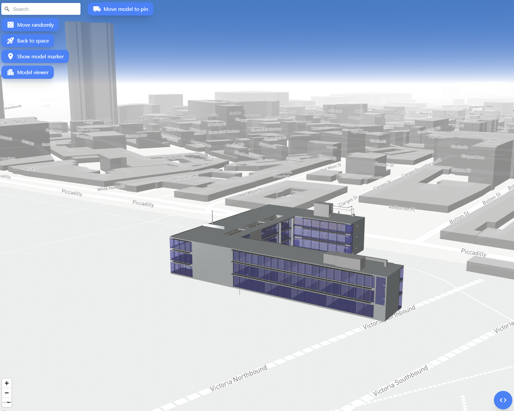

# BIM-GIS Viewer


Try it out: [https://extraordinary-belekoy-ee7fa8.netlify.app](https://extraordinary-belekoy-ee7fa8.netlify.app)

Watch demo: [https://youtu.be/4PvLQ1qMmKI](https://youtu.be/4PvLQ1qMmKI)

Honorable Mention in IFC.js Crash Course 1st Edition Hackathon: [https://www.linkedin.com/posts/antonio-gonz%C3%A1lez-viegas-8b2326151_openbim-opensource-activity-6974052235869618176-YJH-/](https://www.linkedin.com/posts/antonio-gonz%C3%A1lez-viegas-8b2326151_openbim-opensource-activity-6974052235869618176-YJH-/)

## Key Features

- Place your model anywhere you want or move it randomly (BIM-GIS integration)
- Support 3D measurement
- Read IFC properties by clicking elements
- Add clipping planes to find internal elements
- Change background color of the viewer with a color palette
- Preprocessing, memory management and multithreading support

## How To Use

Get a free Mapbox API Key at [https://www.mapbox.com/](https://www.mapbox.com/)

```bash
# Clone this repository
$ git clone https://github.com/helenkwok/bim-gis-viewer.git

# Go into the repository
$ cd bim-gis-viewer

# Install dependencies
$ npm install

# Run Rollup
$ npm run build
```

Store your API in .env and Use [Live Server](https://marketplace.visualstudio.com/items?itemName=ritwickdey.LiveServer) to serve the app

## Credits

This software uses the following open source packages:

- [IFC.js](https://ifcjs.github.io/info/)
- [Three.js](https://threejs.org/)
- [Mapbox GL JS](https://www.mapbox.com/mapbox-gljs)
- [Node.js](https://nodejs.org/)
- [Nodemon](https://nodemon.io/)
- [Dexie.js](https://dexie.org/)
- [Rollup](https://rollupjs.org/guide/en/)
- [Dotenv](https://dotenv.org/)
